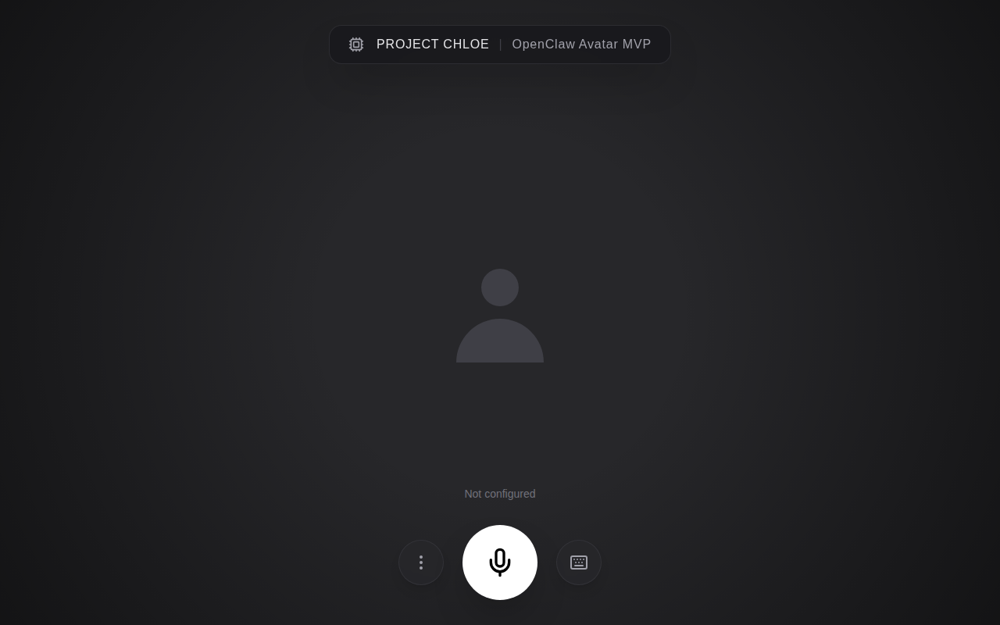

# OpenClaw Avatar MVP (Project Chloe) 🧬💋

## Overview
This repository houses the Minimum Viable Product (MVP) frontend for the **OpenClaw Avatar** project. Inspired by the "Chloe" android from *Detroit: Become Human*, this project aims to create a hyper-realistic, real-time, emotive digital interface for OpenClaw AI agents.

Instead of a text terminal, the user engages with a lifelike digital entity that speaks, reacts, and emotes in real-time, bridging the gap between human and machine.

## Screenshots (FE Development)

| Main Interface (Dark) | Chat Experience |
|:---:|:---:|
|  |  |

| Settings & Config | Light Mode |
|:---:|:---:|
|  |  |

## System Architecture

This frontend acts as the "Face and Ears", while OpenClaw acts as the "Brain".

![System Architecture](https://mermaid.ink/svg/c2VxdWVuY2VEaWFncmFtCiAgICBhY3RvciBVc2VyIGFzIEJpZyBKYWsKICAgIHBhcnRpY2lwYW50IE5leHRKUyBhcyBOZXh0LmpzIEZyb250ZW5kCiAgICBwYXJ0aWNpcGFudCBPcGVuQ2xhdyBhcyBPcGVuQ2xhdyBCYWNrZW5kCiAgICBwYXJ0aWNpcGFudCBMTE0gYXMgTExNIE1vZGVsCiAgICBwYXJ0aWNpcGFudCBFbGV2ZW5MYWJzIGFzIEVsZXZlbkxhYnMKCiAgICBOb3RlIG92ZXIgVXNlciwgTmV4dEpTOiAxLiBUaGUgRWFycwogICAgVXNlci0-Pk5leHRKUzogU3BlYWtzCiAgICBOb3RlIHJpZ2h0IG9mIE5leHRKUzogU2NyaWJlIG9yIFdlYiBTcGVlY2ggQVBJIHRyYW5zY3JpYmVzCgogICAgTm90ZSBvdmVyIE5leHRKUywgT3BlbkNsYXc6IDIuIFRoZSBOZXJ2ZSBTeXN0ZW0KICAgIE5leHRKUy0-Pk9wZW5DbGF3OiBUcmFuc2NyaWJlZCBUZXh0CgogICAgTm90ZSBvdmVyIE9wZW5DbGF3LCBMTE06IDMuIFRoZSBCcmFpbgogICAgT3BlbkNsYXctPj5MTE06IFJlcXVlc3QKICAgIExMTS0tPj5PcGVuQ2xhdzogVGV4dCBSZXNwb25zZQoKICAgIE9wZW5DbGF3LS0-Pk5leHRKUzogU3RyZWFtcyByZXNwb25zZQoKICAgIE5vdGUgb3ZlciBOZXh0SlMsIEVsZXZlbkxhYnM6IDQuIFRoZSBWb2ljZQogICAgTmV4dEpTLT4-RWxldmVuTGFiczogVFRTIFJlcXVlc3QKICAgIEVsZXZlbkxhYnMtLT4-TmV4dEpTOiBBdWRpbyBTdHJlYW0KCiAgICBOZXh0SlMtPj5Vc2VyOiBQbGF5cyBhdWRpbyBhbmQgdHJhbnNjcmlwdCBvdmVybGF5Cg)

## Tech Stack (MVP)
- **Frontend Framework:** Next.js 14 (App Router), React, Tailwind CSS, TypeScript.
- **3D Engine:** Three.js, React Three Fiber (@react-three/fiber), React Three Drei (@react-three/drei).
- **Lipsync System:** Custom Web Audio FFT analysis + Morph Target manipulation (Oculus-style visemes).
- **Speech-to-Text (STT):** ElevenLabs Scribe v2 Realtime (WebSocket) + Web Speech API fallback.
- **Text-to-Speech (TTS):** ElevenLabs API (proxied via Next.js `/api/tts`) + Web Speech API fallback.
- **Backend Logic:** OpenClaw daemon (WebSocket/REST).

## Features

- **3D Avatar:** Real-time rendered 3D character with idle animations and procedural eye blinking.
- **Audio-Driven Lipsync:** Real-time mouth movement synchronized with TTS audio via frequency analysis.
- **Simulated Lipsync Fallback:** Procedural lipsync for Browser-native TTS (Web Speech API) where direct audio analysis is restricted.
- **Voice input:** Push-to-talk mic with rolling-window live transcription (green text).
- **Text input:** Chat window with keyboard input and Markdown support.
- **AI responses:** Streamed from OpenClaw via WebSocket or REST.
- **Voice output:** ElevenLabs TTS with rolling-window transcript overlay (red text).
- **Settings:** Gateway URL, OpenClaw API key, ElevenLabs API key + voice ID, light/dark theme.
- **Attachments:** Image, PDF, and text file uploads.

## Configuration

1. **OpenClaw Gateway:** Connect to your OpenClaw daemon (WebSocket URL + API key).
2. **ElevenLabs:** Add your API key for STT (Scribe) and TTS. Use a default voice (e.g. Adam) on free tier; library voices require a paid plan.

## Getting Started

First, run the development server:

```bash
npm run dev
# or
yarn dev
# or
pnpm dev
# or
bun dev
```

Open [http://localhost:3000](http://localhost:3000) with your browser. Click the gear icon to configure Gateway and ElevenLabs settings.

## Roadmap

| Status | Item |
|--------|------|
| [x] | ElevenLabs Scribe STT (cross-browser) |
| [x] | ElevenLabs TTS with Web Speech fallback |
| [x] | Connect to OpenClaw backend (WebSocket) |
| [x] | Rolling window live transcript overlay (green/red) |
| [x] | 3D Avatar Rendering with Three.js |
| [x] | Audio-driven Lipsync (FFT / Visemes) |
| [x] | Simulated Lipsync Fallback for Browser TTS |
| [x] | File attachments (image, PDF, text) |
| [ ] | Complex Emotion/Expression Mapping |
| [ ] | Photo-realistic model textures and shaders |
| [ ] | AI Video API Integration (optional fallback) |
