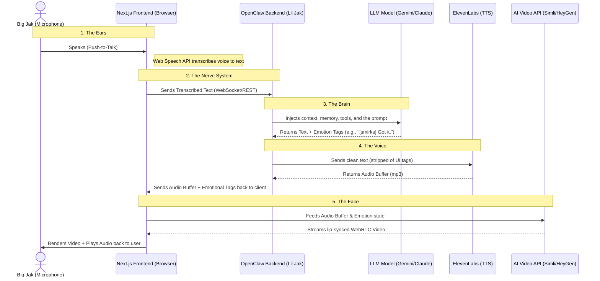

# OpenClaw Avatar MVP (Project Chloe) 🧬💋

## Overview
This repository houses the Minimum Viable Product (MVP) frontend for the **OpenClaw Avatar** project. Inspired by the "Chloe" android from *Detroit: Become Human*, this project aims to create a hyper-realistic, real-time, emotive digital interface for OpenClaw AI agents.

Instead of a text terminal, the user engages with a lifelike digital entity that speaks, reacts, and emotes in real-time, bridging the gap between human and machine.

## System Architecture

This frontend acts as the "Face and Ears", while OpenClaw acts as the "Brain".



## Tech Stack (MVP)
- **Frontend Framework:** Next.js 14 (App Router), React, Tailwind CSS, TypeScript.
- **Speech-to-Text (STT):** Browser Native `Web Speech API` (Client-side, zero latency).
- **Text-to-Speech (TTS):** ElevenLabs API (Proxied through OpenClaw backend).
- **AI Video Generation:** Real-time WebRTC stream via Simli / LivePortrait / HeyGen.
- **Backend Logic:** OpenClaw daemon (WebSocket/REST).

## Getting Started

First, run the development server:

```bash
npm run dev
# or
yarn dev
# or
pnpm dev
# or
bun dev
```

Open [http://localhost:3000](http://localhost:3000) with your browser to see the result.

## Immediate Roadmap
- [ ] Generate the photorealistic base portrait using Midjourney/Flux.
- [ ] Implement Web Speech API (STT) for push-to-talk capability.
- [ ] Connect the Next.js frontend to the OpenClaw backend.
- [ ] Hook the audio buffer into the generative AI Video API.